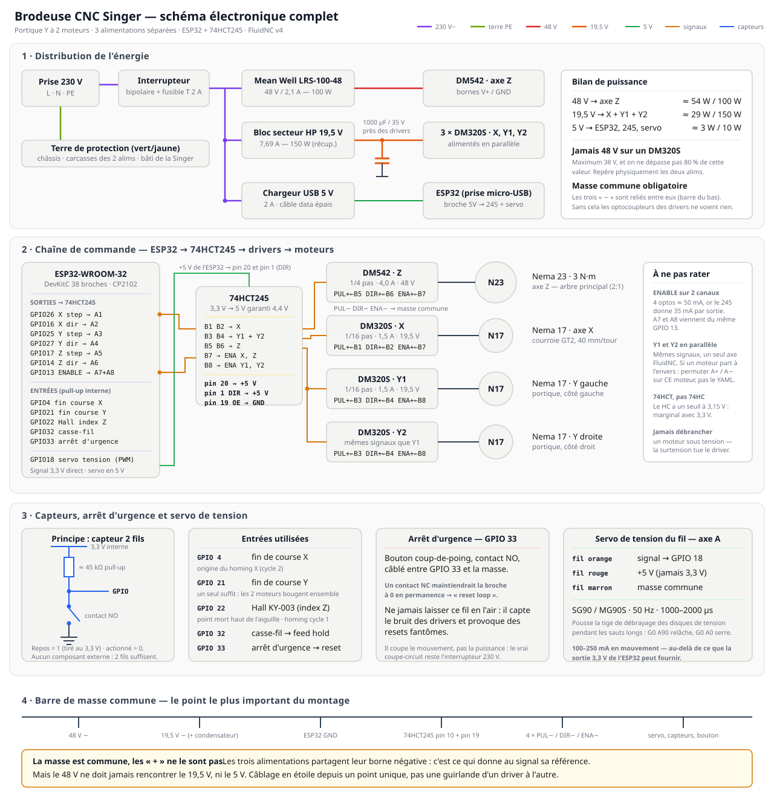

# Câblage et brochage

## Schéma d'ensemble



Le fichier [`schema-electronique-complet.svg`](schema-electronique-complet.svg) est la référence : distribution secteur 230 V avec interrupteur bipolaire et fusible, terre de protection, les trois alimentations, l'ESP32, le 74HCT245, les quatre drivers (dont Y1/Y2 en parallèle), les moteurs, les capteurs, l'arrêt d'urgence et le servo — plus la barre de masse commune.

Le [`schema-cablage.svg`](schema-cablage.svg) d'origine reste disponible : plus compact, il ne montre que la partie basse tension. Ouvre l'un ou l'autre dans un navigateur pour zoomer.

## Architecture

```
   Secteur
      │
      ├── Alim 48 V ────► DM542 ──────► Nema 23 (axe Z)
      │   (LRS-100-48)
      │
      ├── Alim 19,5 V ─┬─► DM320S ─────► Nema 17 (axe X)
      │    (bloc HP    ├─► DM320S ─────► Nema 17 (axe Y gauche)
      │     récupéré)  └─► DM320S ─────► Nema 17 (axe Y droite)
      │
      └── USB 5 V ───────► ESP32 + 74HCT245
                              │
                              └── signaux step/dir/enable en 5 V
```

⚠️ **Alimentation du contrôleur séparée de celle des moteurs.** Une alimentation commune court-circuite l'isolation galvanique des optocoupleurs. Avec un Nema 23 qui commute 4,2 A sous 48 V, le bruit se propagerait directement dans l'ESP32.

## Pourquoi le 74HCT245

L'ESP32 sort en **3,3 V**. Les entrées des DM542/DM320S sont optocouplées et dimensionnées pour du **5 V** : leur résistance interne est calculée pour tirer ~15 mA sous 5 V. En 3,3 V, le courant tombe à ~2 mA — sous le seuil fiable de déclenchement.

Le 74HCT245 résout les deux problèmes à la fois :

- famille **HCT** → seuil d'entrée à 2,0 V, donc 3,3 V est lu comme un HIGH franc
- sortie garantie **4,4 V minimum**
- **35 mA par canal** en source ou en sink, largement de quoi alimenter les optos

⚠️ Prendre du **74HCT245**, pas du 74HC245. Le HC a un seuil à 3,15 V : les 3,3 V de l'ESP32 passeraient tout juste, ça marcherait sur l'établi et lâcherait au milieu d'une broderie.

### Câblage du 74HCT245 (DIP-20)

| Broche | Signal | Raccordement |
|---|---|---|
| 1 | DIR | **+5 V** (sens A → B) |
| 2–9 | A1–A8 | entrées, depuis l'ESP32 |
| 10 | GND | masse |
| 11–18 | B8–B1 | sorties, vers les drivers |
| 19 | OE | **GND** (sorties actives) |
| 20 | VCC | +5 V |

## Brochage ESP32 (38 broches)

### Sorties vers les drivers (via 74HCT245)

Le portique Y a **deux moteurs** (un de chaque côté), donc **quatre drivers** au total. Les deux drivers Y reçoivent les **mêmes signaux**, câblés en parallèle.

| Signal | GPIO | Canal 245 | Destination |
|---|---|---|---|
| X step | 26 | A1 → B1 | DM320S X, PUL+ |
| X dir | 16 | A2 → B2 | DM320S X, DIR+ |
| Y step | 25 | A3 → B3 | **DM320S Y1 + Y2**, PUL+ (parallèle) |
| Y dir | 27 | A4 → B4 | **DM320S Y1 + Y2**, DIR+ (parallèle) |
| Z step | 17 | A5 → B5 | DM542, PUL+ |
| Z dir | 14 | A6 → B6 | DM542, DIR+ |
| ENABLE X + Z | 13 | A7 → B7 | ENA+ de X et Z |
| ENABLE Y1 + Y2 | 13 | A8 → B8 | ENA+ de Y1 et Y2 |

Les broches `PUL−`, `DIR−` et `ENA−` de tous les drivers vont à la **masse commune**.

⚠️ **Pourquoi l'ENABLE est réparti sur deux canaux (B7 et B8).** Chaque entrée d'opto tire ~10–15 mA, et le 74HCT245 fournit 35 mA max par sortie. Avec 4 drivers, un seul canal ENABLE dépasserait (~40–60 mA). On alimente donc les canaux A7 et A8 depuis le **même GPIO 13**, et on répartit les 4 ENA+ en deux paires. Idem, prudence, sur Y step/dir : chaque canal pilote 2 optos (~30 mA), c'est dans les clous.

### Entrées

| Signal | GPIO | Note |
|---|---|---|
| Fin de course X | 4 | pull-up interne activé (`:pu`) |
| Fin de course Y | 21 | pull-up interne activé |
| Capteur Hall (index Z) | 22 | KY-003, collecteur ouvert |
| Détecteur casse-fil | 32 | câblé en *feed hold* |
| Arrêt d'urgence | 33 | câblé en *reset*, bouton vers GND |

Reprise (*cycle start*) : via l'interface web FluidNC, pas de bouton dédié.

⚠️ **Pourquoi pas les GPIO 34–39 ?** Ils sont en entrée seule et **sans pull-up interne** : ils flottent et donnent des lectures fantômes (constaté en simulation Wokwi). Les utiliser exigerait des résistances externes de 10 kΩ vers 3,3 V. Les GPIO 4/21/22/32/33 ont un pull-up interne : capteur câblé en deux fils (signal + masse), zéro composant.

### Combien de fins de course faut-il ?

**Deux sont indispensables** : X sur GPIO 4, Y sur GPIO 21. Ce ne sont pas des sécurités mais les **références d'origine** de la machine. Le YAML impose `must_home: true` — sans elles, FluidNC refuse tout mouvement, et un motif brodé n'aurait aucun repère commun d'une session à l'autre.

Un seul capteur suffit pour Y, même avec deux moteurs : ils sont mécaniquement solidaires du portique et bougent ensemble.

L'axe Z n'a pas de fin de course mécanique, mais un **capteur Hall** (GPIO 22) qui indexe l'aiguille au point mort haut. C'est le même rôle : donner une origine.

**Les capteurs en trop ne sont pas inutiles.** Trois usages, par ordre d'intérêt :

1. **Rechange.** Un microrupteur de fin de course finit par s'user ou se dérégler. En avoir deux d'avance évite d'arrêter le projet pour une pièce à 1 €.

2. **Butée de fin de course opposée.** Chaque axe n'est protégé que d'un côté. Un second capteur à l'autre extrémité déclenche une alarme si le chariot déborde. Utile pendant la mise au point, quand `steps_per_mm` ou `max_travel_mm` sont encore approximatifs.

3. **Doubler le capteur Y.** Avec un capteur par côté du portique, FluidNC peut détecter qu'il s'est mis en biais (`squaring`). C'est un raffinement, pas une nécessité sur une course de 180 mm.

Pour l'usage 2, deux montages possibles :

| Montage | Câblage | Limite |
|---|---|---|
| Un GPIO par capteur | GPIO 19 et 23 (libérés par l'abandon du SD) | consomme des broches |
| Les deux en parallèle sur un GPIO | contacts NO reliés au même fil | FluidNC ne sait pas lequel a déclenché |

Les contacts NO en parallèle fonctionnent bien : n'importe lequel qui se ferme tire la broche à la masse. Utiliser `limit_all_pin` dans le YAML plutôt que `limit_neg_pin`.

⚠️ Éviter **GPIO 5** pour cet usage : c'est une broche de strapping. Un capteur actionné au moment du démarrage empêcherait la carte de booter. GPIO 19 et 23 n'ont pas ce défaut.

⚠️ **Contacts NO, pas NC.** Un microrupteur câblé en normalement fermé maintient la broche à la masse en permanence — sur GPIO 33 cela provoque le fameux « reset loop ». Vérifie chaque capteur au multimètre avant de le monter : relâché = circuit ouvert, actionné = continuité.

### Servo de débrayage de la tension du fil (axe A)

| Signal | GPIO | Note |
|---|---|---|
| Servo PWM | 18 | signal 3,3 V direct, servo alimenté en 5 V |

Un petit servo (SG90 ou MG90S) pousse la **tige de débrayage des disques de tension** de la Singer. Pendant un saut long, le post-processeur relâche la tension (`G0 A90`) pour que le fil se dévide sans casser ni tirer le tissu, puis la ré-engage (`G0 A0`).

- **Alimentation : le 5 V, pas le 3,3 V.** Un servo tire 100–250 mA en mouvement, trop pour la sortie 3,3 V de l'ESP32. Fil rouge → 5 V, fil noir → masse commune, fil signal → GPIO 18.
- Le signal 3,3 V est accepté par la plupart des servos. Si le tien est capricieux, passe-le par un canal libre du 74HCT245.

### Pas de carte SD — on brode en WiFi

Le lecteur SD est abandonné : on envoie les fichiers G-code via l'interface web de FluidNC. Ça libère les GPIO 5, 18, 19, 23 — dont le **18 sert maintenant au servo**.

Configuration WiFi (par commandes, une fois FluidNC flashé) :

```
$Sta/SSID=MonReseau
$Sta/Password=MonMotDePasse
$WiFi/Mode=STA
```

## Broches à éviter

| GPIO | Problème |
|---|---|
| 0, 2, 12, 15 | broches de strapping — un mauvais niveau au reset empêche le démarrage |
| 1, 3 | UART0, utilisé par le port USB série |
| 6–11 | reliées à la flash interne, inutilisables |

## Réglages des drivers

### DM542 (axe Z)

| Réglage | Valeur | Raison |
|---|---|---|
| Microstepping | **1/4** (800 pas/tour) | à 400 pts/min et 2:1 → 10 700 pas/s. En 1/16 ce serait 42 700 pas/s |
| Courant | **4,2 A** | correspond au Nema 23 de 3 N·m |
| Tension | **48 V** | indispensable au couple en vitesse |

### DM320S (axes X/Y)

| Réglage | Valeur | Raison |
|---|---|---|
| Microstepping | **1/16** (3200 pas/tour) | 80 pas/mm → résolution 0,0125 mm |
| Courant | selon les Nema 17 | typiquement 1,2–1,7 A |
| Tension | **19,5 V** (bloc HP) | plage driver 12–38 V. ⚠️ jamais plus de 38 V |

Le 19,5 V ne bride pas la vitesse : à 120 mm/s (180 tr/min), inverser le courant demande 0,52 ms alors que la demi-période en offre 3,33 — **6× de marge**.

⚠️ **Condensateur 1000 µF / 35 V** en parallèle sur la sortie du bloc HP, au plus près des drivers. Les alimentations de PC portable supportent mal l'énergie renvoyée par les moteurs en décélération (BEMF) et peuvent couper. Respecter la polarité : bande blanche vers le −.

## Détecteur de casse-fil

Une roue libre montée sur le trajet du fil, avec un aimant collé dans sa jante et un capteur Hall en regard. Le fil défile → la roue tourne → le capteur émet des impulsions.

Si aucune impulsion n'arrive pendant 5 ou 6 points consécutifs, c'est que le fil est cassé ou que la canette est vide : le firmware met en pause via l'entrée *feed hold*.

Sans ce détecteur, une casse de fil se traduit par plusieurs milliers de points brodés dans le vide, et surtout par la difficulté de retrouver le point exact où reprendre.
